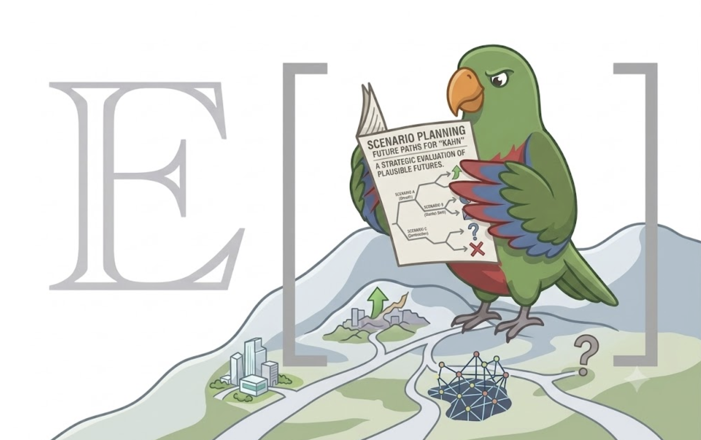

# kahn — two-axis strategic scenario-planning CLI
<!-- id: kahn/kahn -->

<p align="center">
  
</p>

[View the project website](https://expectedparrot.github.io/kahn/)

kahn structures strategic uncertainty work into environmental forces, critical uncertainties, a two-axis scenario matrix, strategic options, and a final scenario report. The agent uses it to facilitate scenario planning with the user, separating known forces from uncertain drivers, selecting the two most consequential uncertainties, generating scenario narratives, and evaluating options across futures.

## Installation

Kahn requires Python 3.11 or newer. Install the current Kahn and EDSL `main`
branches as an isolated command-line tool with
[uv](https://docs.astral.sh/uv/):

```bash
uv tool install --upgrade --force \
  --with-executables-from "edsl @ git+https://github.com/expectedparrot/edsl.git@main" \
  "kahn @ git+https://github.com/expectedparrot/kahn.git@main"
```

If `uv` is not installed:

```bash
python -m pip install --upgrade uv
```

Verify that both CLIs resolve from uv's tool directory:

```bash
uv tool dir --bin
command -v kahn
command -v ep
kahn --help
ep --help
```

Before running a generated EDSL job, check authentication and connectivity:

```bash
ep auth status
ep profiles current
ep check
```

If authentication is missing, run `ep auth login` and follow its login flow.
Never display, copy, or commit API keys.

For local development from a cloned checkout:

```bash
git clone https://github.com/expectedparrot/kahn.git
cd kahn
python -m pip install -e .
pytest -q
```

The [online guide](https://expectedparrot.github.io/kahn/) explains the method and the complete CLI workflow.

## When to use this
<!-- id: kahn/when-to-use -->

- The user faces a strategic decision under external uncertainty.
- The goal is to explore plausible futures, not forecast one expected case.
- The analysis can be framed around forces, uncertainties, scenarios, and options.
- The user needs a report or workshop artifact that supports robust planning.

## When this is a stretch (and how to adapt)
<!-- id: kahn/when-stretch -->

- The user has a single quantifiable gamble. Use kahn to frame broad futures only if narratives matter; use [raiffa](#raiffa/raiffa) for decision-tree analysis.
- The user wants to rank options against fixed criteria. Use kahn to generate scenarios, then [mcda](#mcda/mcda) to score options across criteria.
- The uncertainties are all internal execution risks. Reframe as a [premortem](#premortem/premortem) or include only external uncertainties in kahn.
- The user has too many possible axes. Capture all as uncertainties, score salience/uncertainty, and force the final matrix to two axes.
- The user needs probabilities. Keep scenario planning qualitative, then layer probabilities in [raiffa](#raiffa/raiffa) only if defensible.

## Decision rule for the calling agent
<!-- id: kahn/decision-rule -->

Before dispatching to kahn, confirm:

1. The decision is strategic and materially shaped by external uncertainty.
2. The user wants multiple plausible futures rather than a point forecast.
3. Candidate forces and uncertainties can be elicited from the user or context.
4. Strategic options can be tested against the resulting scenarios.

If yes to all four, kahn is the right method.

## Inputs and elicitation
<!-- id: kahn/inputs -->

### Focal decision and horizon
<!-- id: kahn/inputs-focal-decision -->

What it is: the strategic question, decision owner, and time horizon for the scenarios.

How the agent elicits this:
- Ask: "What decision will these scenarios inform, and by when must it be made?"
- Ask for the planning horizon: 1 year, 3 years, 5 years, or another relevant period.
- Ask what would make the exercise useful: option robustness, early-warning signals, strategic imagination, or stakeholder alignment.

Default to suggest: a 3-5 year horizon for market/technology strategy; shorter for tactical operating decisions.

Fallback: if the user is vague, draft a focal question and ask for confirmation before adding forces.

### Forces and uncertainties
<!-- id: kahn/inputs-forces-uncertainties -->

What it is: relatively predictable environmental forces and uncertain drivers that could change the future.

How the agent elicits this:
- Ask for political, economic, social, technological, regulatory, competitive, and customer forces.
- Separate "important but predictable" from "important and uncertain."
- For each uncertainty, ask for two plausible extremes.
- Score or discuss impact and uncertainty to choose the two matrix axes.

Default to suggest: capture 8-15 forces/uncertainties, then narrow to two high-impact, high-uncertainty axes.

Fallback: if the user is stuck, propose a PESTLE-style starter list and let the user edit.

### Strategic options
<!-- id: kahn/inputs-options -->

What it is: actions, bets, hedges, or capabilities to evaluate across scenarios.

How the agent elicits this:
- Ask what decisions are actually on the table.
- Distinguish commitments, no-regret moves, options, and monitoring triggers.
- Ask what resources, constraints, or risk tolerance limit the options.

Default to suggest: 3-6 options, including at least one no-regret move and one contingent bet.

Fallback: if options are not ready, complete scenario narratives first and derive option ideas from scenario implications.

## Outputs
<!-- id: kahn/outputs -->

kahn produces:

- A project state with forces, uncertainties, selected axes, scenarios, phases, options, and snapshots.
- Scenario narratives for the four combinations of two critical uncertainties.
- Option evaluations and robustness notes across scenarios.
- Validation/status output for workflow completeness.
- Generated report artifacts and portable, model-free EDSL Jobs packages for AI-assisted scenario work.

## Workflow
<!-- id: kahn/workflow -->

Canonical sequence:

1. `kahn init` — create the scenario project.
2. `kahn force ...` — capture environmental forces.
3. `kahn uncertainty ...` — capture uncertainties and extremes.
4. `kahn scenario ...` — select axes and create four scenario narratives.
5. `kahn option ...` — add strategic options and evaluate them across scenarios.
6. `kahn validate` — check completeness and internal consistency.
7. `kahn report generate` — produce the scenario-planning report.
8. `kahn snapshot save` — preserve a milestone state before major revisions.

Use `kahn status` and `kahn phase ...` to recover workflow position.

## Worked examples
<!-- id: kahn/examples -->

### Exploring market-entry uncertainty
<!-- id: kahn/example-market-entry -->

User: "We’re considering entering a new market, but regulation and customer adoption are uncertain."

Agent: "Kahn fits this. Let’s set the focal decision as market entry over a three-year horizon. Regulation and adoption sound like candidate axes, but I’ll first capture other forces so we don’t prematurely pick the matrix."

User: "Competitors and supply chain also matter, but regulation/adoption feel biggest."

Agent: "I’ll add those as forces or uncertainties, define extremes for regulation and adoption, then build the four scenarios and test entry options against them."

```bash
kahn init market_entry
kahn force add --name competitors --description "Incumbent response and new entrants"
kahn uncertainty add --name regulation --low restrictive --high permissive
kahn uncertainty add --name adoption --low slow --high rapid
kahn scenario create --x regulation --y adoption
kahn option add --name staged_entry --description "Pilot market entry before full rollout"
kahn report generate
```

Output: a four-scenario matrix with narratives and option implications.

### Recovering and continuing a workshop
<!-- id: kahn/example-recover-workshop -->

```bash
kahn status
kahn uncertainty list
kahn scenario list
kahn option list
kahn validate
```

Output: current phase, existing inputs, and validation gaps before the agent resumes facilitation.

## Quick command reference
<!-- id: kahn/commands -->

For full options, run `kahn <subcommand> --help`.

| Command | Purpose |
|---|---|
| `kahn init` | Initialize a scenario-planning project. |
| `kahn status` / `phase` | Show or manage workflow phase. |
| `kahn force ...` | Manage environmental forces. |
| `kahn uncertainty ...` | Manage critical uncertainties and extremes. |
| `kahn scenario ...` | Create and manage scenario narratives. |
| `kahn option ...` | Add and evaluate strategic options. |
| `kahn validate` | Check project completeness and consistency. |
| `kahn report ...` | Generate and show reports. |
| `kahn snapshot ...` | Save, list, or restore milestone snapshots. |
| `kahn docs` | Read built-in scenario-planning guidance. |
| `kahn job generate ...` | Build portable, model-free `*.jobs.ep` packages. |
| `kahn ingest ...` | Validate and import EDSL `Results` into project state. |

## EDSL execution boundary

Kahn designs AI-assisted work but does not select or call a model. The `ep`
client owns inspection, cost estimation, and execution:

```bash
kahn job generate research-forces --output jobs/research-forces.jobs.ep
ep inspect jobs/research-forces.jobs.ep
ep jobs cost jobs/research-forces.jobs.ep
ep run jobs/research-forces.jobs.ep --model gpt-5-nano \
  --output jobs/research-forces-results.ep
kahn ingest forces --from jobs/research-forces-results.ep
```

The same boundary applies to `write-narrative` and `evaluate-options`. Preserve
both the Jobs and Results artifacts: the former records the research design,
and the latter records answers and model provenance.

## Common pitfalls
<!-- id: kahn/pitfalls -->

- Choosing axes too early can hide more important uncertainties; capture a broad set first.
- Scenarios are not forecasts. Avoid attaching fake precision unless probabilities are separately justified.
- Axes should be independent enough to create four distinct futures.
- Strategic options should be evaluated across all scenarios, not only the preferred future.
- Internal execution risks belong in option assessment or [premortem](#premortem/premortem), not as scenario axes unless they depend on the external environment.

## Cross-references
<!-- id: kahn/xrefs -->

- Downstream: [mcda](#mcda/mcda) can rank options after scenario implications are clear; [premortem](#premortem/premortem) can stress-test the chosen strategy.
- Adjacent methods: [raiffa](#raiffa/raiffa) for probabilistic staged decisions; [dcf](#dcf/dcf) for monetary valuation of scenario-specific cash flows.
- Reporting: [gutenberg](#gutenberg/gutenberg) compiles final scenario reports.

## State contract
<!-- id: kahn/state -->

A kahn project stores forces, uncertainties, scenarios, options, phase state, report artifacts, and snapshots in the project directory. Treat CLI-managed records as the source of truth; use snapshots before major workshop revisions or axis changes.

## JSON output and error codes
<!-- id: kahn/json -->

kahn commands emit structured output where supported. Validation errors usually indicate missing scenario axes, incomplete uncertainty extremes, absent option evaluations, or report prerequisites; fix the named project object and rerun `kahn validate`.

## License

Kahn is released under the [MIT License](LICENSE).
